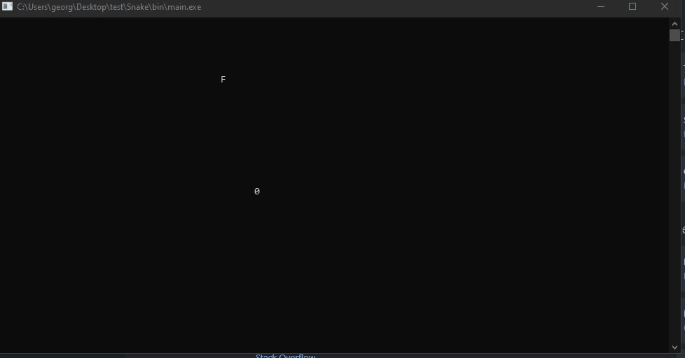

# Snake

This is a recreation of the clasic game snake built in C++ and running in the terminal. Head of the snake is a "0" and is controlled by the user using arrow keys. The user must make its way around the the board picking up all the food "F". As the player picks up more food the body of the snake will slowly increase. You must survive as long as you can without runnning into the walls or yourself. 

